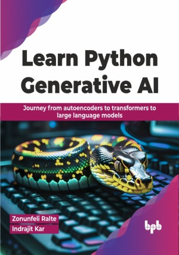

# Learn Python Generative AI

Learn to unleash the power of AI creativity 
This is the repository for [Learn Python Generative AI
](https://bpbonline.com/products/learn-python-generative-ai?variant=43185310793928),published by BPB Publications.

## About the Book
This book researches the intricate world of generative Artificial Intelligence, offering readers an extensive understanding of various components and applications in this field.

The book begins with an in-depth analysis of generative models, providing a solid foundation and exploring their combination nuances. It then focuses on enhancing TransVAE, a variational autoencoder, and introduces the Swin Transformer in generative AI. The inclusion of cutting edge applications like building an image search using Pinecone and a vector database further enriches its content. The narrative shifts to practical applications, showcasing GenAI's impact in healthcare, retail, and finance, with real-world examples and innovative solutions. In the healthcare sector, it emphasizes AI's transformative role in diagnostics and patient care. In retail and finance, it illustrates how AI revolutionizes customer engagement and decision making. The book concludes by synthesizing key learnings, offering insights into the future of generative AI, and making it a comprehensive guide for diverse industries.

Readers will find themselves equipped with a profound understanding of generative AI, its current applications, and its boundless potential for future innovations.

## What You Will Learn
• Acquire practical skills in designing and implementing various generative AI models.

• Gain expertise in vector databases and image embeddings, crucial for image search and data retrieval.

• Navigate challenges in healthcare, retail, and finance using sector specific insights.

• Generate images and text with VAEs, GANs, LLMs, and vector databases.

• Focus on both traditional and cutting edge techniques in generative AI.

